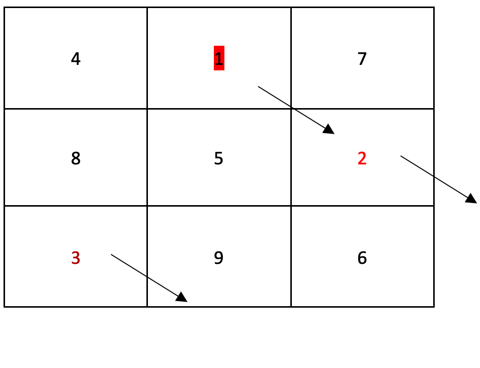
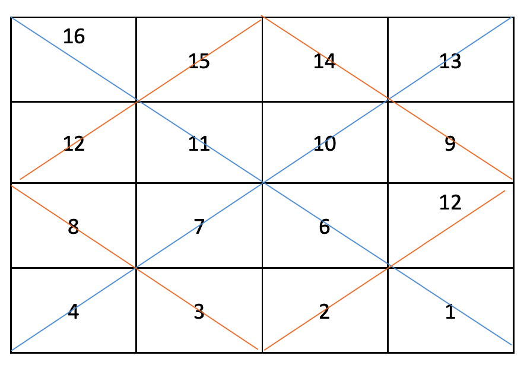
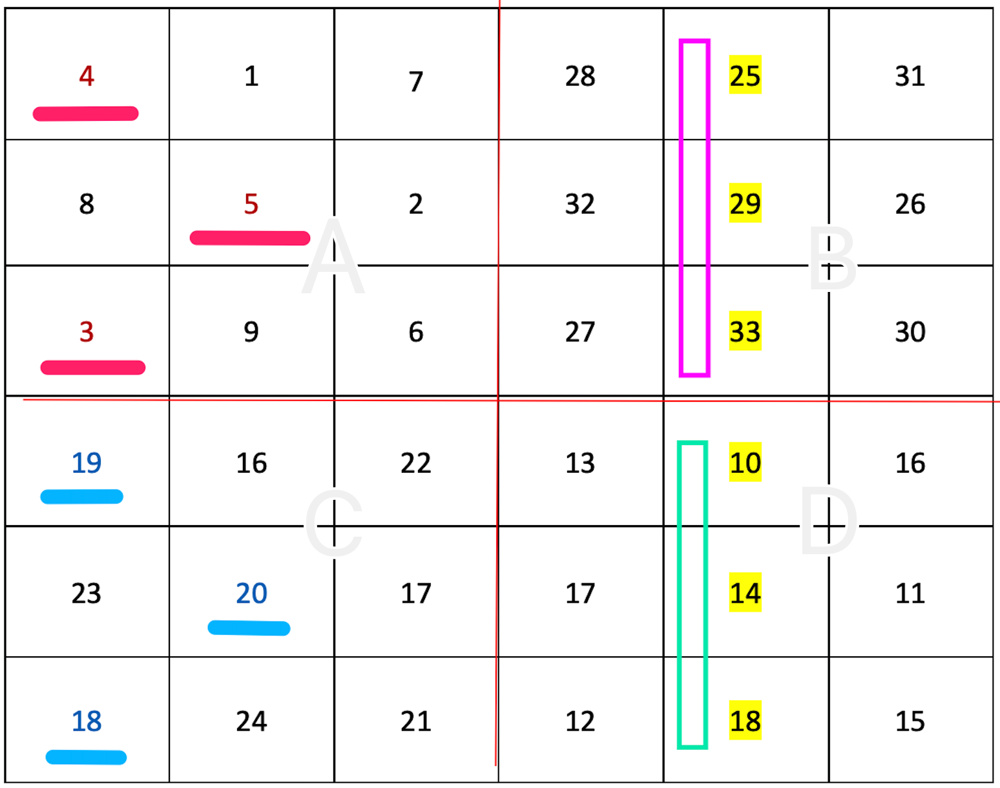

# 幻方问题
幻方（Magic Square）是一种将数字安排在正方形格子中，使**每行**、**每列**和**对角线**上的数字和都相等（`SUM(N)/sqrt(N)`）的方法。其中N为格子总数且`sqrt(N)>=3`。

一下假设 `X = sqrt(N)`：

## 奇数阶幻方(1 == X%2)
罗伯填数法：
- 把起始数1放在(i=0, j=X/2+1)的位置。
- 下一个数的尝试坐标：`i = (i+1)%X`，`j = (j+1)%X`；
- 如果尝试坐标已经有值了，则 `i = i+1%X`，j不变；



## 双偶数阶幻方(0 == X%4)
海尔填数法：
- 从左到右从上到下依次填入1-N的数字。
- 找到横竖方向的中心线，从左到右上到下把幻方分成A、B、C、D四个象限。
- 四个象限的对角线数值都换成 (N+1 - i)形式的互补数。




## 单偶数阶幻方(2 == X%4)
斯特拉兹填数法：
- 找到横竖方向的中心线，从左到右上到下把幻方分成A、B、C、D四个象限。
- 按 `A -> D -> B -> C` 的顺序使用奇数阶罗伯填法填充满。
- 对调AC象限对应标记位的数据：
    - 中间行从中间列开始向右标记k格（k=N/4)；
    - 非中间行从最左列开始向右标记k格。
- 对调BD象限对应标记位的数据：所有行从中间列开始从向左标记k-1格（6阶幻方无需交换BD）。




## ShowCode
```cpp
int main();
```
