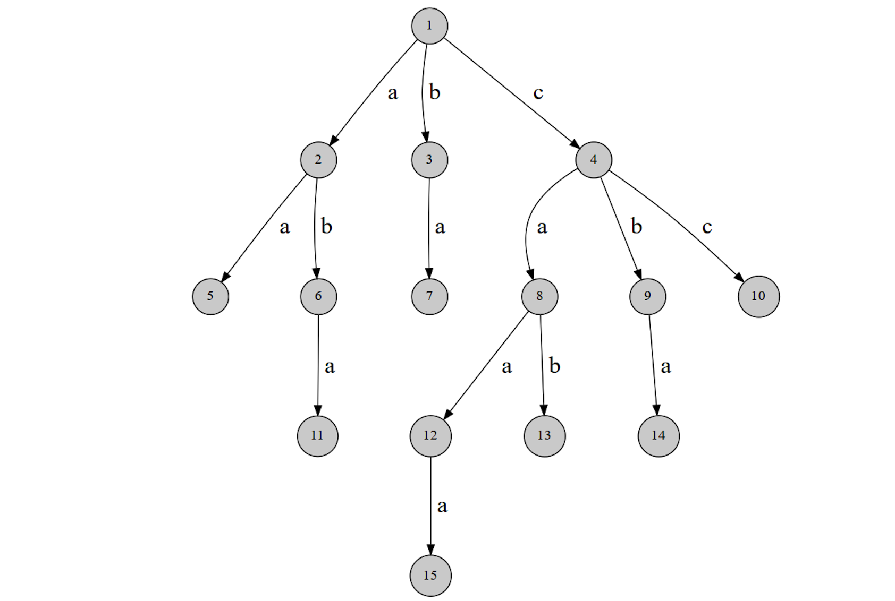

# 2.4 字典树

字典树Trie用边来代表字母，而从根结点到树上某一结点的路径就代表了一个字符串。如下图:



路径`1 -> 4 -> 8 -> 12`表示字符串`caa`。


## 检索字符串
给出n个名字串，然后进行m次点名，每次需要回答“名字不存在”、“第一次点到该名字”、“已经点过这个名字”之一。

其中:`1 <= n <= 10^4, 1 <= m <= 10^5`，所有字符串长度不超过`50`。

```cpp

```


