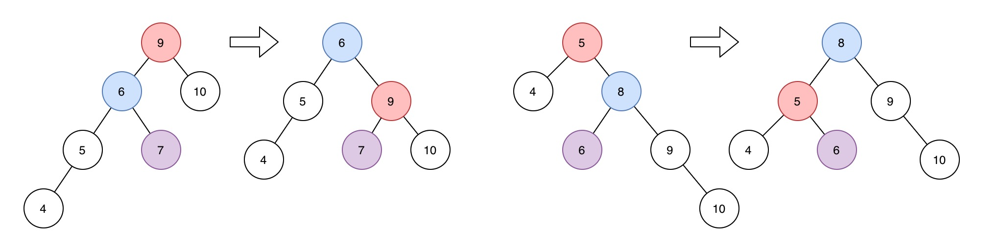

# 7.3 平衡树

## 二叉查找树
规定二叉树的`左子树根 <= 根结点 < 右子树根`，则该树的中序序列即为有序序列，查找时间O(logN)；

当结点被删除时：
- 只有一个子树，子树根替换当前结点。
- 有左右子树，找到左子树的最右结点替换当前结点（或右子树的最左结点）。

```cpp

```

为控制数的深度，应旋转使左右子树深度相差不大，否则查找的时间复杂度会退化到O(N)。
## 自平衡树(AVL)
AVL是一棵有限制的二叉搜索树(`L < RT < R`)，其要求左右子树深度最大不超过1(`|depth(L) - depth(R)| <= 1`)。
最小不平衡树：`|depth(L) - depth(R)| == 2`的子树，当结点插入AVL时最多有1棵最小不平衡树。

### 旋转
- LL型右旋：当新结点在最小不平衡树的左孩子的左子树中时；将左子结点旋转到根。
- RR型左转：当新结点在最小不平衡树的右孩子的右子树中时；将右子结点旋转到根。
- LR型旋转：当新结点在最小不平衡树的左孩子的右子树中时；先将左子结点的右子结点旋转到左子树根，再将左子结点旋转到根。
- RL型旋转：当新结点在最小不平衡树的右孩子的左子树中时；先将右子结点的左子结点旋转到右子树根，再将右子结点旋转到根。



### 删除
- 叶子结点：直接删除，再向上调整平衡
- 非叶子结点：
    - 只有左孩子：用前驱结点的值替换当前结点，再移除前驱结点。
    - 只有右孩子：用后继结点的值替换当前结点，再移除后继结点。
    - 有左右孩子：用层级更高的子树中的前驱/后继结点的值替换当前结点，再移除子树中的结点。

```cpp

```

