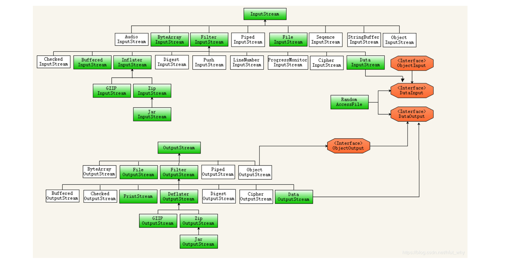
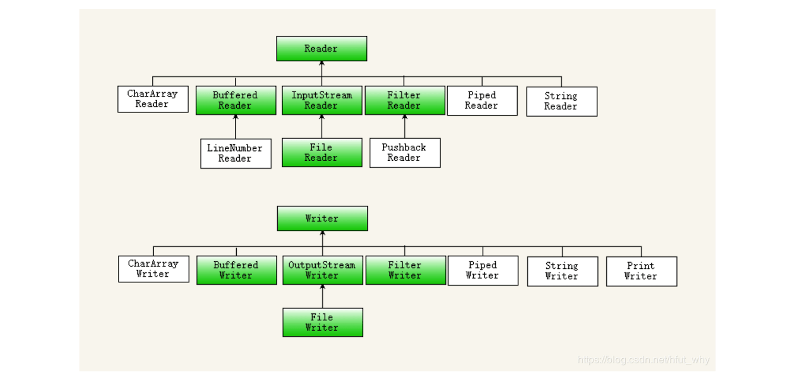

# 6.1 文件IO
字节流`InputStream/OutputStream`，字符流`Reader/Writer`：
- 涉及外部资源的流(如`FileInputStream`)需主动释放资源；仅涉及内存的流(如`ByteArrayInputStream`)则可省略。
- 使用带缓存区的流可以提高IO效率，如`BufferedInputStream`、`BufferedWriter`。





## File读写
`java.io.File`可用来描述文件和文件夹：
1. 创建:
    - 文件：`file.createNewFile()`
    - 目录：`file.mkdir()`、`file.mkdirs()`;
2. 删除:
    - 文件：`file.delete()`
    - 目录：`file.delete()` 删除空目录，非空目录需递归删除
3. 重命名: `file.renameTo(destFile)` 可用来移动文件
4. 查询:
    - 物理存在性探测: `file.exits()`
    - 类型探测: `file.isDirectory()`、`file.isFile()`
    - 路径/文件名: `file.getAbsolutePath()`、`file.getCanonicalPath()`、`file.getName()`
    - 文件长度: `file.length()` 返回字节数
    - 目录子文件表: `file.list()`、`file.listFiles()`
5. 分隔符：
    - 路径分隔符：`File.pathSeparator`，如 `":"`
    - 目录分隔符：`File.separator`，如 `"/"`

```java
    // 资源路径：Project/Main/build/resources/main/res.txt 或 target.jar!/res.txt
    Main.class.getClassLoader().getResource("res.txt");
    Main.class.getResource("/res.txt");

    // 起进程的路径：Project/Main/ 或 ~/ (在主目录执行:~$ java -jar target.jar)
    new File("./").getCanonicalPath();
    System.getProperty("user.dir");

public static void main(String[] args) throws IOException {
    String input = Objects.requireNonNull(JMain.class.getResource("/res.txt")).getFile();
    // Stream字节流文件拷贝
    try (InputStream ins = new BufferedInputStream(new FileInputStream(input));
            OutputStream out = new BufferedOutputStream(new FileOutputStream("out.txt"))) {
        int b;
        while (-1 != (b = ins.read())) {
            out.write(b);
        }
    }
    // Reader字符流读取文件
    Reader reader = new BufferedReader(new FileReader("out.txt"));
    try (Writer writer = new BufferedWriter(new OutputStreamWriter(System.out))) {
        reader.transferTo(writer);
    }
}
```

## 文件锁
可用文件锁来控制多进程的资源获取顺序：
- `FileChannel` 操作文件的通道，总是在阻塞模式下读写数据
- `FileLock` 文件锁，只能通过FileChannel获取，持锁进程不能重入

```java
void doInFileLock(Runnable runnable) throws IOException {
    File file = new File("./.lock");
    if (!file.exists() && !file.createNewFile()) {
        return;
    }
    synchronized (JMain.class) { // 添加线程锁，防止进程内重入
        //noinspection resource
        RandomAccessFile raf = new RandomAccessFile(file, "rw");
        try (FileLock ignored = raf.getChannel().lock()) { // 默认是排它锁
            // 获取进程锁后，执行任务
            runnable.run();
        }
    }
}
```

## 序列化
通过`ObjectInputStream`、`ObjectOutputStream`读写对象，保存数据。

```java
// 序列化
try (ObjectOutputStream out = new ObjectOutputStream(new FileOutputStream("data.obj"))) {
    out.writeObject(obj0);
}
// 反序列化
try (ObjectInputStream in = new ObjectInputStream(new FileInputStream("data.obj"))) {
    obj1 = (User) in.readObject();
}
```

### 自动序列化
实现`Serializable`接口，声明`serialVersionUID`字段指定版本

```java
public class User implements Serializable {
    private static final long serialVersionUID = 1L;

    protected int id;
    protected String name;
    protected transient double salary; // transient字段不参与序列化

    // 可不保留空构造方法
    public User(int id, String name, double salary) {
        this.id = id;
        this.name = name;
        this.salary = salary;
    }

    @Override
    public String toString() {
        return "User{" + "id=" + id + ", name='" + name + '\'' + ", salary=" + salary +'}';
    }
}
```

### 自定义序列化
实现`Externalizable`接口复写流转换接口, 需保留空构造方法反序列化时调用, 支持对数据做一些处理(比如压缩、加密)

```java
public class User implements Externalizable {
    private static final long serialVersionUID = 1L;

    private int id;
    private String name;
    private double salary; // 不参与序列化的字段需手动处理

    public User() {} // 保留无参构造器

    public User(int id, String name, double salary) {
        this.id = id;
        this.name = name;
        this.salary = salary;
    }

    @Override
    public void writeExternal(ObjectOutput out) throws IOException {
        out.write(id);
        // 写出时，保留处理可变长数据长度
        out.write(name.getBytes().length);
        out.write(name.getBytes());
    }

    @Override
    public void readExternal(ObjectInput in) throws IOException, ClassNotFoundException {
        id = in.read();
        // 读取时，根据可变长数据长度处理
        byte[] bytes = new byte[in.read()];
        in.read(bytes);
        name = new String(bytes);
    }
}
```
