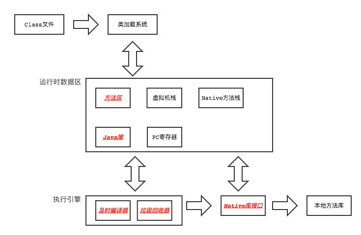
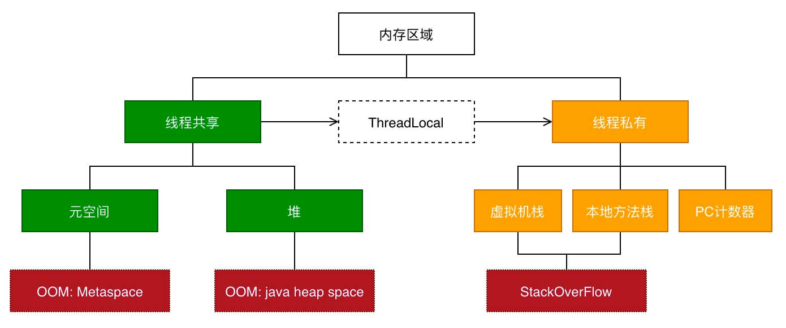
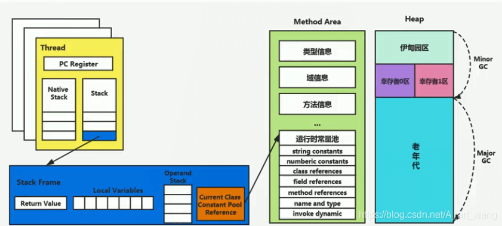
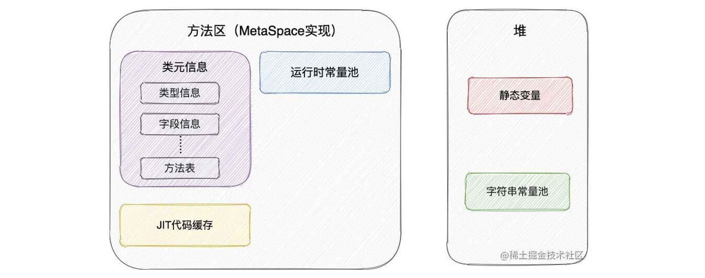

# 7.1 虚拟机结构

Java虚拟机只与Class文件有关联，任何语言(Java,Groovy,Kotlin)只要能编译成Class文件就可被执行。

- HotSpotVM：OracleJDK和OpenJDK中自带的虚拟机。
- J9VM：多用途虚拟机(服务端、桌面应用、嵌入式)，性能大致和HotSpot VM相当。
- Zing VM：启动后会快速预热；Heap可达1TB,GC耗时在10ms以下；配套有监控工具Zing Vision。



## 7.1.1 JVMM





1. PC寄存器: 保存当前线程下一条待执行指令地址
2. 方法调用栈: HotSpot中两个栈并未区分
   - Java方法栈: 用于Java方法调用
   - Native方法栈: 用于`native`方法调用
3. 堆：保存运行时创建的对象
   - PSYoungGen: 新生代
      - Eden: 新对象首先分配到伊甸园区(若对象太大直接放到老年代)
      - S0/S1: MinorGC时把Eden和From-Survivor中的存活对象拷贝到To-Survivor
   - PSOldGen: 老年代，大对象和超过了一定年龄阈值的对象会被放在这里
4. 方法区：JDK8后用本地内存来实现称为Metaspace(JDK7之前用堆的PermGen实现),
   - 类元信息: 包括类型信息、字段信息、方法信息
   - 运行时常量池: 包括类型、字段、方法的直接引用和常量
   - JIT代码缓存: 保存即时编译器优化后的代码
5. 直接内存: 不由JVM管理，可通过`ByteBuffer.allocateDirect():DirectByteBuffer`使用。


## 7.1.2 堆
类在加载后会在方法区保存该类的元数据和常量池，并在堆中创建该类的Class实例。

JDK7+后，静态变量存储在类的Class实例中(之前静态变量也保存在方法区)，为方便内存回收字符串常量池也从方法区移到了堆中。


## 7.1.3 方法区



### 类元信息
1. JVM对每个加载的类型,包括类、接口、枚举、注解类，会在方法区中存放该类型的元数据: 
   - 修饰符: public,abstract,final的一个子集
   - 有效名称: 含包名和类名
   - 直接父类有效名、直接接口名的有序列表
2. JVM保存每个类型的所有字段元信息和声明顺序:
   - 修饰符: public,private,protected,static,final,volatile,transient的一个子集
   - 字段类型签名
   - 字段名
3. JVM保存类型中所有方法的元信息和声明顺序:
   - 修饰符: public,private,protected,static,final,abstract,synchronized,native的一个子集
   - 方法签名: 包括返回值类型、方法名、入参类型和顺序
   - 非abstract/native的方法还有：
      - 方法体字节码: 字节码指令或指向JIT缓存
      - 局部变量表、操作数栈及它们的大小
      - try-catch异常表: 表中的项目包括捕获开始位置、捕获结束位置、处理代码指令偏移、该异常类型的运行时常量池索引

### 运行时常量池
每个`.class`文件中都包含一个的常量池，包括本文件中用到的: 对其他类/字段/方法的符号引用, 字面常量(字符串、浮点数、比short大的整数)。
JVM为每个加载的类型在运行时常量池中维护该类型的常量池表，而该表中的符号引用会被替换成直接引用(地址或偏移)。


### JIT代码缓存
在HotSpotVM中内嵌有两个JIT编译器: Client Compiler(C1编译器)和Server Compiler(C2编译器):
- C1编译器会对字节码进行简单和可靠的优化，编译速度更快
- C2编译器会启动一些编译耗时更长的优化，编译质量更好


### 方法区GC
在大量使用反射、动态代理、CGLib等字节码框架，动态生成JSP以及OSGi这类频繁自定义类加载器的场景中，通常都需要Java虚拟机具备类型卸载的能力，以保证不会对方法区造成过大的内存压力。
- 回收常量池的常量: 常量没有被引用时，可直接回收
- 卸载不再使用的类: 需满足3个条件1.堆中不再有该类以及派生类的实例 2.该类的Class对象没有被引用了 3.加载该类的类加载器被回收了

*注*: HotSpot提供了`-Xnoclassgc`参数控制不卸载类，还可用`-verbose:class`以及`-XX:+TraceClass-Loading`、`-XX:TraceClassUnLoading`查看类加载和卸载信息。

## 7.1.4 直接内存
直接内存即Native堆，不受JVM管理，在某些和native库通信的场景可避免数据频繁在Java堆和Native堆拷贝带来的消耗。

```java
// 虚引用: 可在子线程中调阻塞方法queue.remove(); 当获取到Reference对象时表明有对象被回收了
ReferenceQueue<Object> queue = new ReferenceQueue<>();
PhantomReference<Object> ref = new PhantomReference<>(new Object(), queue);

// NIO: ByteBuffer，需要添加编译参数: javac --add-exports java.base/sun.nio.ch=ALL-UNNAMED
ByteBuffer buffer = ByteBuffer.allocateDirect(100);
buffer.put((byte) 0xFF);
buffer.put(0, (byte) 0x80);
buffer.get();
// 以大端序(地址放高字节)取4B组成一个int: Integer.MIN_VALUE = 0x80000000
int res = buffer.getInt(0);
// ByteBuffer内部利用虚引用通知，在GC回收无ByteBuffer对象时释放Native内存
// 也可以手动释放
((DirectBuffer) buffer).cleaner().clean();
```


## 7.1.5 相关工具
### 内存分析工具
```bash
# 查看JVM进程, 
jps -l
# 查看类加载情况
jstat -class <pid>
# 统计各内存区间使用情况和GC情况, 间隔1000ms共查询3次
jstat -gc <pid> 1000 3
# 查看堆空间使用详情 注意jmap的版本要和jvm版本匹配，或使用: jhsdb
sudo jmap -heap <pid>
sudo jhsdb jmap --heap --pid <pid>
# dump内存快照,可使用JDK的jvisualvm工具或下载MAT工具分析
jmap -dump:format=b,file=my-dump.bin <pid>

```

### JVM内存配置参数
```bash
# 设置每个线程的Java方法栈大小 -XX:ThreadStackSize
-Xss128k

# 初始堆大小
-Xms512m 相当于 -XX:InitialHeapSize=512m
# 最大堆大小
-Xmx2g 相当于 -XX:MaxHeapSize=2g
# 设置堆中年轻代的大小，固定值
-Xmn2g
# 新生代比例, 值为2时表示年轻代:老年代=1:2
-XX:NewRatio=2
# 幸存者比例, 值为8时表示 Eden:S0:S1 = 8:1:1
-XX:SurvivorRatio=8
# 对象进入老年代的年龄阈值
-XX:MaxTenuringThreshold=15

# 初始的元空间大小(64位通常21MB)，将满时触发FullGC卸载无用的类，之后重新调整阈值
-XX:MetaspaceSize=21m 
# 最大元空间值，不限制表示最大可耗尽系统内存
-XX:MaxMetaspaceSize=-1 
#  输出jvm载入类的相关信息，当jvm报告说找不到类或者类冲突时可此进行诊断。
-verbose:class
# 指定JIT编译器
-client
-server

# 显示GC详情
-verbose:gc
-XX:+PrintGCDetails

# 查看参数默认值
java -XX:+PrintCommandLineFlags -version
java -XX:+PrintFlagsFinal -version

# 查看某进程参数
jinfo -flags <pid>
jinfo -flag InitialHeapSize <pid>
```


