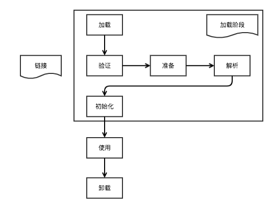

# 7.2 类加载

## Class文件
- 符号引用：用符号来描述所引用的目标，与JVM的内存布局无关。符号引用存在于class文件中。
- 直接引用：以一个地址表示引用的目标，与虚拟机的内存布局相关，且指向的目标一定已经加载到内存中了。

```java
// 可通过 javap -v ClassName 查看
// ux 代表无符号，x字节
ClassFile{
    u4 magic; // 0XCAFEBABE，是否能被JVM处理的标志
    u2 major_version; // 主版本
    u2 minor_version; // 副版本

    // 常量池相关
    u2 const_pool_cnt; 
    cp_info const_pool[const_pool_cnt - 1];

    // 继承相关
    u2 access_flags; // 层次访问标志
    u2 super_class; // 父类索引
    u2 this_class; // 类索引

    // 接口相关
    u2 interfaces_cnt;
    u2 interfaces[interfaces_cnt]

    // 字段相关
    u2 fields_cnt;
    field_info fields[fields_cnt];

    // 方法相关
    u2 methods_cnt;
    method_info methods[methods_cnt];

    // 属性相关，如SourceFile表示从哪个源文件编译的
    u2 attrs_cnt;
    attribute_info attrs[attrs_cnt]; 
}
```

## 类加载过程


1. 加载：Classloader根据特定的名称在路径中查找类或接口的.class文件
2. 链接：
   - 验证：验证`.class`文件内容确保数据正确。
   - 准备：为静态字段分配默认的0值。
   - 解析：把`.class`文件转为方法区的运行时数据结构(即Klass对象，其中的符号引用会被替换为直接引用), 并在堆中生成这个类的Class对象(即oop实例)保存到`Klass#_java_mirror` 
3. 初始化：执行由于静态变量赋值、静态块合成的`<cinit>()`方法。

```java
// Klass和oop是相互指向的: _java_mirror -> Class实例头Klassword -> Klass实例
// 以下寻找过程: 向由对象头的Klassword找到方法区Klass实例，再经_java_mirror找到对中的Class对象
Class<?> c = new Object().getClass();
```


## 类加载器
类加载器采用双亲委派模型(优先让父类加载),同一个类若由不同的Classloader加载Class对象是不同的。

- BootstrapClassLoader: 加载JDK的核心类，Java无法访问; 路径`$JAVA_HOME$/jre/lib/`、`-Xbootclasspath`、`sun.boot.class.path`
- ExtClassLoader: 核心类之外的系统类; 路径`$JAVA_HOME$/jre/lib/ext/`、`java.ext.dirs`
- AppClassLoader: 当前应用Classpath; 路径`java.class.path`, 获取Loader`ClassLoader.getSystemClassLoader()`

*注*: `System.getProperty(key)`可通过JVM启动参数`-Dkey`指定，但需注意这样会覆盖默认值。

