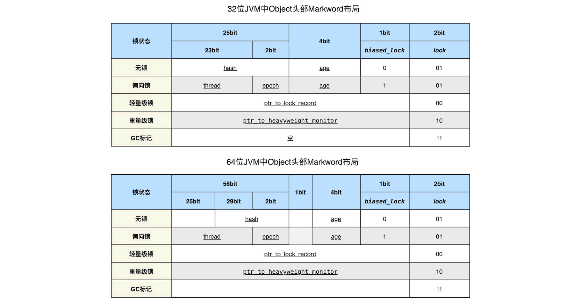
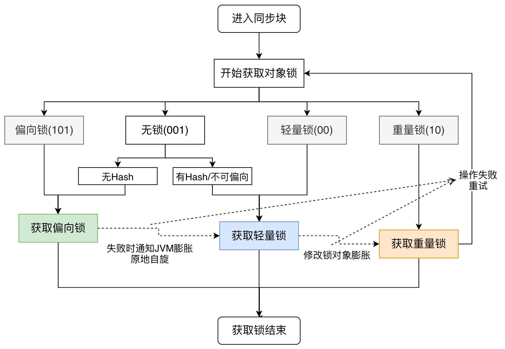

# 7.3 对象内存布局和生命周期

## 对象的内存布局
1. 对象头部:
   - Mark word: JVM字长(32b或64b)，在不同锁状态下结构也不同，内容包含了
      - hash: 哈希值25b/31b, 调用`obj.hashCode()/System.identityHashCode(obj)`后才生成;
      - age: 分代年龄4b,故`-XX:MaxTenuringThreshold`最大值为15
      - biased_lock: 偏向锁标识1b
      - lock: 锁状态2b
      - thread: 持有偏向锁的线程ID
      - epoch: 配合Class对象中的epoch字段用于禁用偏向(重偏撤销过多开销过大)
      - ptr_to_lock_record: 轻量级锁状态下，指向栈中锁记录的指针
      - ptr_to_heavyweight_monitor: 重量级锁状态下，指向对象监视器Monitor的指针
   - Klass word: JVM字长，指向方法区中当前对象所属的类元数据,即Klass对象。
   - Array length: 仅数组对象才有，默认为JVM字长，开启指针压缩后固定为32b
2. 实例字段/数组元素: 1.相同宽度的字段一起存放，父类字段在子类字段前，按声明顺序排布。
3. 对齐填充: HotSpot要求对象起始地址必须是整数倍8B，即对象的大小必须是`N*8B`；。



```java
Object obj = new Object() { short x = 0; }; // JVM64: (8+4) +2 +2 = 16B
// ClassLayout在 org.openjdk.jol:jol-core:0.16
obj.hashCode();
System.out.println(ClassLayout.parseInstance(obj).toPrintable());
boolean[] arr = new boolean[29]; // (8+4+4) + 29 + 3
System.out.println(ClassLayout.parseInstance(arr).toPrintable());
```

### 指针压缩
64位JVM使用64位的指针将浪费大量内存(+50%)。为了节约内存JVM默认启用了`-XX+UseCompressedOops`压缩指针至32位：
- 静态变量、成员变量、对象数组元素指针 会被压缩至32位(Spothot中对象对齐8B，即一次读取64b，所以32位指针能访问`2^32*2^3*2^3=32GB`内存)
- 但局部变量、函数出入参、非Heap对象指针不会被压缩。


### 对象锁膨胀


1. 偏向锁: JDK15+默认已经禁用偏向锁，可用`-XX:+UseBiasedLocking`打开
   - 获取: 当所属类的Class对象中未标记不可偏向时,若对象为无锁状态且头部无hash,或已为偏向锁状态; 尝试以CAS方式设置头部thread为当前线程ID, 若失败则等JVM膨胀锁
   - 释放: 持锁线程不会主动释放，但当有线程竞争时，持锁线程运行到SafePoint时STW,锁会根据线程是否已出同步块而被膨胀为轻量级锁 或 解除偏向关联
2. 轻量级锁: 运行到同步块时不会立即挂起线程切换到内核态
   - 获取: 
      - 当对象是无锁状态时(或从偏向锁膨胀), 在当前线程栈中开辟解释帧存放锁记录(拷贝了Mark Word), 再以CAS方式更新对象头, 若失败先自旋再失败膨胀锁。
      - 当对象是轻量锁状态, 若ptr_to_lock_record指向当前线程栈,则表示已获取, 否则将膨胀锁为重量级锁并挂起当前线程
   - 释放: CAS方式从LockRecord中恢复对象头的MarkWord, 若失败则意味着锁已膨胀，则根据ptr_to_heavyweight_monitor唤起一个挂起线程
3. 重量级锁: 运行到同步块时会切换到内核态由OS调度
   - 获取: 当锁从轻量锁膨胀时, 创建Monitor对象(也称内部锁)将MarkWord拷贝进去,再将当前线程放入队列等待, 并以CAS更新对象头后切到内核态, 若失败则重新尝试获取锁
   - 释放: 若队列非空则唤醒下一个线程，若为空SpotHot会尝试将MarkWord恢复到无锁状态

*注:* 
- 当对象头已是偏向锁状态，再生成Hash会使对象头部切换到重量锁状态,因为要在堆中构建Monitor对象来存放MarkWord
- 若同步块中有使用`wait()/notify()`方法，则对象锁只能是重量级锁


## 对象的生命周期
1. 被创建Created：初始化和并执行完构造方法
2. 使用中In Use：存在至少一个强引用
3. *不可见Invisible：虽然还有强引用，但强引用以已不可访问(指令已出作用域)
4. 不可达Unreachable：GCRoots的强引用链不可达
5. 被收集Collected：GC准备重新分配该内存空间，调用`obj.finalize()`前
6. 被终结Finalized：执行完`obj.finalize()`仍然不可达，就等待GC回收
7. 消亡Deallocated：内存被GC回收或重新分配


*注*: 若发生内存泄漏(Memory Leak,不再使用的对象无法回收)，容易导致内存溢出(Memory Overflow,内存不够使用而崩溃)


### 对象的创建过程
1. 生成/查找Class对象：根据类名(主类名、符号引用)执行类加载、链接、初始化，取得Class对象。
2. 分配内存: 先尝试在TLAB(Thread Local Allocation Buffer)分配，若不够就更换TLAB或在TLAB外分配。
3. 内存初始化: 所有内存值初始化为0。
4. 设置对象头: Mark word、Klass word、Array length。
5. 先执行由成员变量赋值、构造块合成的`<init>()`方法，再执行构造方法。

*注*: 所以初始化的顺序是: 静态变量赋值、静态块执行(`<cinit>()`) > 成员变量赋值、构造块执行(`<init>()`) > 构造方法。

**TLAB与栈上分配**

TLAB用3个指针(start:top:end)表示Eden中的区域(大小约占1%), 仅Owner线程可分配内存以减少同步等待；线程创建时分配一个TLAB但GC后失效。
Hotspot在C2编译器中支持逃逸分析(Escape Analysis)，对没有线程逃逸的代码做锁消除，对没有方法逃逸的代码做标量替换以实现栈上分配。


## 垃圾收集器(GC)
用来分配内存、回收不再引用的对象。可以通过VM启动参数`-XX:+PrintGCDetails`查看GC日志。

Java有4种类型的引用：
- 强引用: 宁愿抛OOM也不回收
- `SoftReference<T>`: 软引用,无强引用只剩软引用的对象在内存不足时回收
- `WeakReference<T>`: 弱引用,无强引用只剩弱引用的对象GC一旦发现即会回收
- `PhantomReference<T>`: 虚引用,对象被回收时会添加到引用队列


### (1)垃圾标记
可达性算法：选定一些对象作为GC Roots根集，向下搜索标记可达与否。GC Roots对象包括：
- 被Java方法栈/Native方法栈中引用的对象。
- 被静态字段引用的对象(static成员)。
- JNI的全局变量。
- 所有的运行中没停止的线程对象(thread)。
- 由Bootstrap Classloader加载的类的实例或其他被GC标记Root的对象。


### (2)分代收集
1. 新生代PSYoungGen：MinorGC, 先把Eden和From-Survivor中存活的对象复制到To-Survivor(age+1)，再调换Survivor。
   - 新生代可细分：`Eden:S1:S2` 在HotSpot默认为`8:1:1`；
   - 若复制时 (1)对象分代年龄超过晋升值`-XX:MaxTenuringThreshold` (2)To Survivor空间已满，则对象直接晋升为老年代。
2. 老年代ParOldGen：FullGC, 先在新生代执行MinorGC，再对老年代执行标记-清除(累计若干次标记清除后改执行标记-压缩)。

*注*: 
- 复制算法：每次把存活的对象复制到另外一半内存，适用于存活对象少的新生代。
- 标记-清除(Mark-Sweep)：对不可达的对象，直接清除(地址段放入闲散空间列表)；会产生较多碎片。
- 标记-压缩(Mark-Compact)：把存活的对象重新排列，回收剩下的内存。


## 对象池
- String池: 字面常量在类加载的链接阶段就放到池中了，也可通过`String.intern()`向池中添加元素。
- Integer池: 对于一个字节内的整型数据`-128~127`，其包装对象是同一个。

## 对象析构
对象在被收集前会调用`finalize()`但已不建议使用，而应使用基于虚引用实现的`Cleaner`

```java
Object obj = new Object();
Cleaner c = Cleaner.create();
Cleaner.Cleanable cleanable = c.register(obj, new Runnable() {
   @Override
   public void run() {
         // 对象被回收时调用,不论主动被动只会回调一次
         System.out.println("obj gc");
   }
});
// 主动释放资源
cleanable.clean();
obj = null;
System.gc(); // 不建议手动调用gc
```