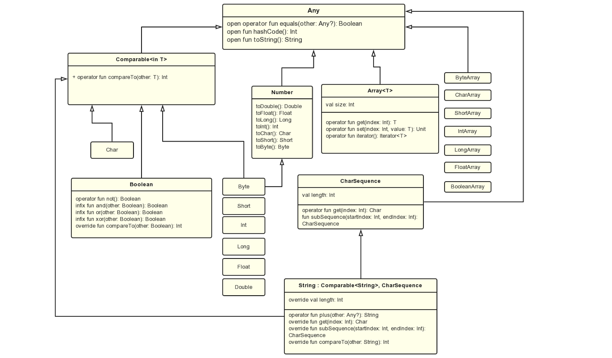
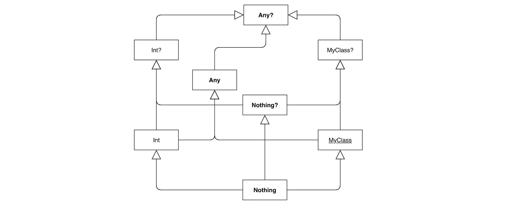

# 2.1 数据类型

Kotlin是强类型的(数值在运行时无隐式拓宽转换)、静态类型(类型检查发生在编译期)、支持类型推导的(当能推导出类型时可省略类型声明)语言。
它没有基本类型(但部分类型会优化为JVM的基本类型)，所有类型都是继承自`Any?`的引用类型: 



```kotlin
val b: Byte = 0b0010_1000; // 1B
val s: Short = 0 // 2B
val i = 1_000 // 4B,数值变量默认推断Int,如果超出范围才推断为Long
val j = 0L // 8B

// Kotlin 1.3引入无符号数值
val ub: UByte = 0xFF_FFU;
val us: UShort = 0U
val ui: UInt = 0U
val uj: ULong = 0UL

val f: Float = 0.0F // 4B,24位有效比特数（6~7位有效数字）
val d: Double = 0.0 // 8B,53位有效比特数（15~16位有效数字）,浮点默认推断Double

val c: Char = 'A' // 2B
val z: Boolean = true // 1B
```

## 类型检测与转换
Kotlin使用`is、!is`来判断实例类型，使用`as、as?`用来显示转换类型。

```kotlin
fun main(args: Array<String>) {
    val s = args.getOrElse(0) { "unknown file" }
    val ss: CharSequence? = if (s is CharSequence) { // is 检测后会自动转换
        s.subSequence(0, s.length).toString()
    } else null // 即当 s !is CharSequence
    // as? 显式转换失败后会得到null
    println((ss as? String)?.plus(" exec over!"))

    var res: Boolean
    res = (s == ss) // 相当于Java的equals()方法调用,且有NPE保护
    res = (s === ss) // 相当于Java的 == , 仅比较对象在的内存地址
}
```


## 可空类型
Kotlin把可空性作为类型系统的一部分，这样能在编译阶段发现可能的错误以减少运行时NPE的可能性。



*注*: 
- Kotlin中 `null === null` 、`null is Nothing?`, 空类型断言通过`Intrinsics`工具类处理，安全调用会被翻译为三元运算符。
- Kotlin提供 `Unit`表示表达式值没无其他用途的(Java中`void`)
- `Nothing::class`为`java.lang.Void`表示表达式结果不能获取的,`Nothing?`只能赋为null


```kotlin
// Java中不安全Case: Integer ni = null; int i = ni; 编译通过但运行报错
val ni: Int? = null // 可空类型
val res: Long? = ni?.toLong() ?: -1L // 安全调用 ?.
println(res!!.toString()) // 非空断言 !!

fun format(num: Double): String =
    if (num.isNaN()) // Double/Float.NaN=-(0.0/0.0) 是唯一和自身不相等的浮点值
        throw RuntimeException("not a num")
    else num.toString()

// 若方法声明为Nothing，则意味着调用后将得不到返回,如exitProcess()
public inline fun exitProcess(status: Int): Nothing {
    System.exit(status)
    throw RuntimeException("System.exit returned normally, while it was supposed to halt JVM.")
}
```


## 数组Array
数组用`Array<T>`表示(也有无装箱开销的`TypeArray`如`IntArray`)，它的`get/set`函数映射到`[]`操作，并有`size`属性，以及迭代器获取`iterator()`函数。

*注*: 与Java不同,Kotlin中数组是不型变的，即`Array<String>`不是`Array<Any>`的子类型

```kotlin
    // 自动升级为 [kotlin.Any;
    val arr = arrayOf(1, 2, "3", false, null, object : Any() {
        override fun toString(): String {
            return "test"
        }
    })
    // 指定类型，元素都填充null（这种非空类型容易导致NPE）
    val sArr = arrayOfNulls<String>(10)
    // 使用构造器+初始化函数创建
    val iArr = Array<String>(10) { i ->
        return@Array "" + (i * i)
    }
    // 无装箱开销的原生类型
    val dArr: DoubleArray = doubleArrayOf(1.0, 2.0)

    println(arr.contentDeepToString())
    println(sArr.contentToString())
    for(i in iArr) println(i) // 用迭代器遍历
```

### 区间
区间是为可比较类型定义的(整型类型有优化实现)，表达式由`..`函数和 `in` 和 `!in` 构成。

```kotlin
    val x = -1
    // 区间 [1, 5]
    if (x !in 1..5) println(x)

    // [0,10]: 0 2 4 6 8 10
    for (i in 0..10 step 2) print("$i ")
    // [0,10): 0 2 4 6 8
    for (i in 0 until 10 step 2) print("$i ")
    // 10 7 4 1
    for (i in 10 downTo 0 step 3) print("$i ")

    // 数组下标是 IntRange 类型
    for (i in arr.indices) println(arr[i])
```

## 字符串String
字符串用`String`表示，和Java一样是不可变的、支持串连接`s = s + any`(表达式首运算数为串时默认执行串连接)。另外：

- 支持下标访问`s[i]` 和 迭代器遍历
- 支持字符串模板，即在串中解析执行表达式`"\$ expression result is ${expression}"`
- 支持原始字符长串(使用三个引号包裹，可以包含换行符，内部不支持转义，但仍支持串模板)

```kotlin
val car = "BMW"
val price = 100000000.00
// 其中trimIndent()对齐切割掉最小空格数，trimMargin()去除前导符前的空格
val res = """
    > The price of $car is \${'$'}${price}
    > emmm, I'll buy one.
""".trimIndent().trimMargin("> ")
print(res)
// The price of BMW is \$1.0E8
// emmm, I'll buy one.
```
